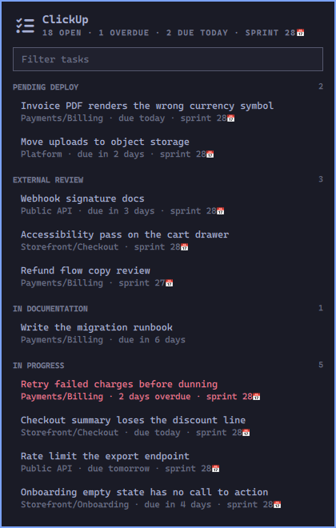
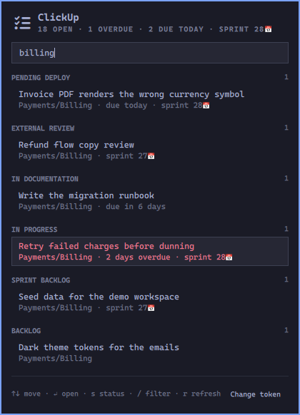
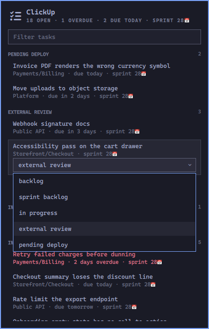

# ClickUp for Omarchy

Your assigned ClickUp tasks in the Omarchy bar, grouped by the status they sit in, with
one keystroke to move a task forward. Everything renders with your current Omarchy theme.



## Install

```bash
omarchy plugin add https://github.com/aislandener/omarchy-clickup.git --enable --yes
```

Or by hand: drop this folder in `~/.config/omarchy/plugins/aislandener.clickup/`, then
`omarchy-shell shell rescanPlugins` and `omarchy plugin enable aislandener.clickup right`.

Requires `curl` and `jq`, both of which Omarchy already installs.

## Connect your account

Click the bar icon. The panel asks for a token the first time:

1. In ClickUp, open **Settings → Apps** and generate a personal API token (it starts
   with `pk_`). The panel has a button that opens that page.
2. Paste it into the field and press Enter.

The token is checked against ClickUp before anything is written, then stored in
`~/.config/omarchy/clickup-token` with mode `600`. It is never passed as a command
argument, so it does not show up in `ps` for other processes on the machine.

Prefer to keep it in a password manager? Write the file yourself and skip the panel:

```bash
umask 077 && op read "op://Private/ClickUp/api token" > ~/.config/omarchy/clickup-token
```

"Change token" at the bottom of the panel brings the field back at any time.

## Open it from the keyboard

The plugin ships no binding of its own. Add one to `~/.config/hypr/bindings.lua`:

```lua
o.bind("SUPER + CTRL + M", "ClickUp tasks", "omarchy-shell shell toggle aislandener.clickup")
```

Going through `shell toggle` rather than the plugin's own IPC target matters as soon as
you have a second monitor: a bar widget is mounted once per screen, and a fixed IPC
target only ever reaches one of those instances.

`omarchy-shell aislandener.clickup refresh` refetches without opening anything.

## Keyboard

| Key | Action |
|-----|--------|
| `↑` `↓` | move between tasks |
| `↵` | open the task in the browser |
| `s` | change the status of the selected task |
| `/` | filter by name, list, folder, status or tag |
| `↵` in the filter | jump to the first match and take the keyboard back |
| `r` | refresh now |
| `Esc` | close |

Right-click a task row also opens the status picker; right-click the bar icon refreshes
without opening the panel. Clicking a section's counter expands it to its full contents.

<p>
  
  
</p>

The filter matches the name, the list, the folder, the status and the tags at once, and
the status picker only offers the statuses that the task's own list actually has.

## How the grouping works

Tasks come from every list in the workspace where you are an assignee, closed ones
excluded. They are grouped by status, and the sections are ordered by the position each
status holds in its own ClickUp workflow — the furthest along at the top, the least
started at the bottom. Nothing to configure, in any language.

Within a section: dated work first, soonest at the top (so overdue rises to the front),
then undated work with the newest sprint tag first. A tag like `sprint 28📅` is
recognised as a sprint in any workspace that names its sprint tags that way.

To pin your own order instead, fill in **Section order** in the widget settings, e.g.
`in progress, pending deploy, external review, backlog`. Statuses you leave out still
appear, after the ones you named.

## Settings

Setup > Plugins > ClickUp:

| Setting | Default | What it does |
|---|---|---|
| Refresh interval | 600s | how often the task list is refetched |
| Section order | empty | comma-separated status names; empty follows ClickUp's own order |
| Rows shown per section | 5 | collapsed section size; sections still expand |

## More than one workspace

When your account has several, a **Workspace** picker appears at the top of the panel,
above the filter. Pick one and it stays picked, in `~/.config/omarchy/clickup.json`. Two
workspaces sharing a name are told apart by their id. Without a choice, the first
workspace the API returns is used.

## The bar icon

Lights up in the theme's urgent colour when something assigned to you is past its due
date. A full backlog is not news; a missed deadline is.

## Development

```bash
bash tests/normalize-test.sh
omarchy plugin validate .
./omarchy-clickup-fetch | jq .
```

`normalize.jq` holds the grouping logic and is what the test exercises, so the helper and
the test can never drift apart. After changing `Panel.qml` or `Service.qml`, run
`omarchy-restart-shell`: saving reloads the plugin's code, but a bar widget that is
already mounted keeps the version it was built with.

## License

MIT
